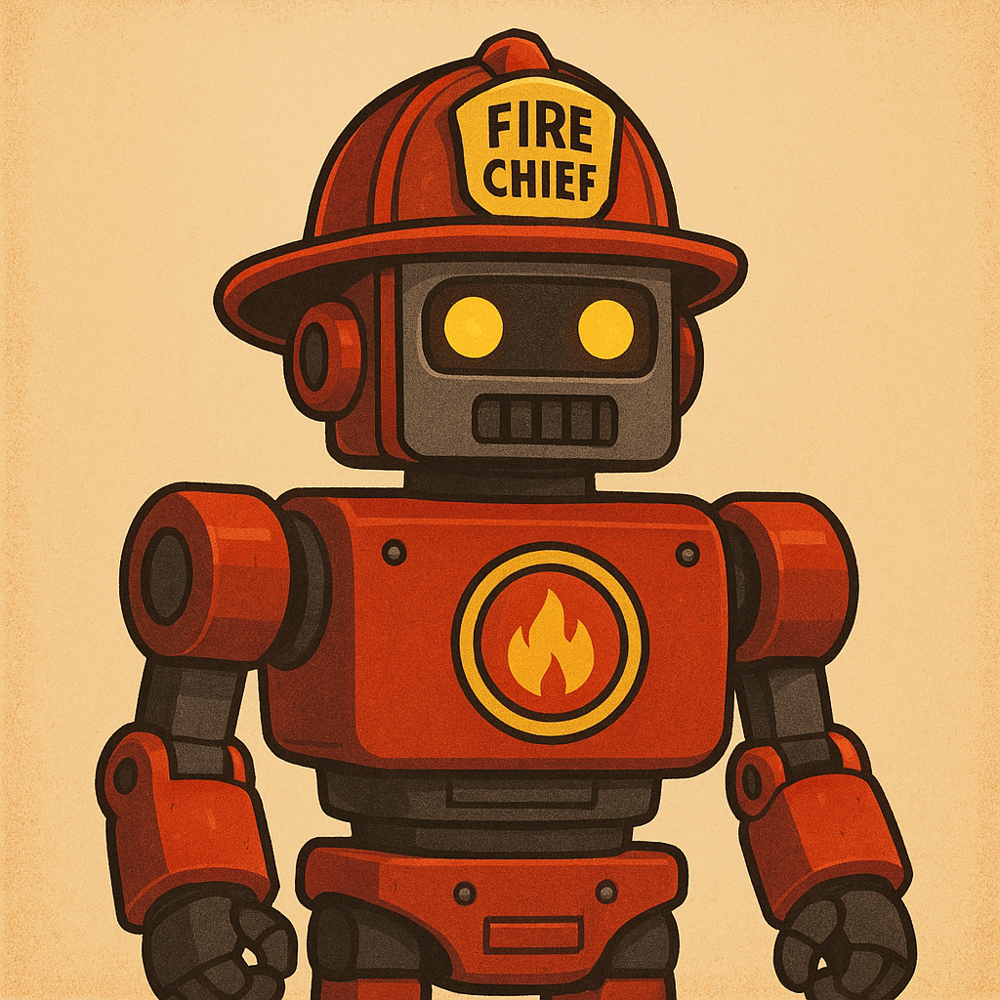

# FireChief Bot

Automated weekly support rotation system for software teams. The FireChief bot manages team member assignments, sends reminders, and posts announcements to Slack, all integrated with Notion for tracking.



## What is Fire Chief?

Fire Chief is a **weekly support rotation role** where one team member acts as the first line of defense for support requests, shielding the rest of the team from interruptions. The bot automates the assignment process and ensures fair rotation.

## Quick Start

1. **Understand the concept**: Read [What is a Fire Chief?](./docs/concept.md)
2. **Set up the bot**: Follow the [Setup Guide](./docs/setup.md)
3. **Use day-to-day**: Reference the [Usage Guide](./docs/usage.md)

## Features

- **Fair Rotation**: Automatically selects Fire Chief based on whom served least recently
- **Volunteer System**: Team members can volunteer for specific weeks
- **Slack Integration**: Posts announcements and pins messages automatically
- **Notion Tracking**: Maintains a history of assignments in structured databases
- **Reminders**: Sends Friday handover reminders to current Fire Chief
- **GitHub Actions**: Fully automated via scheduled workflows

## Documentation

### Getting Started

- [Fire Chief Concept](./docs/concept.md) – Understanding the role and responsibilities
- [Setup Guide](./docs/setup.md) - Initial configuration and deployment
- [Usage Guide](./docs/usage.md) - Day-to-day operations and troubleshooting

### Resources

- [Slack Bot Configuration](./resources/slack-bot.md) – Slack app setup and descriptions
- [Notion Integration](./resources/notion-integration.md) – Notion integration configuration
- [Bot Assets](./resources/) - Logo and design files

## How It Works

**Every Monday at 8:00 AM UTC:**

1. Bot selects the next Fire Chief and Backup
2. Creates entry in Notion Weekly Roster
3. Posts announcements to Slack channels
4. Pins messages for visibility

**Every Friday at 3:00 PM UTC:**

1. Sends a handover reminder to current Fire Chief
2. Prompts preparation of handover notes
3. Pins reminder message

## Architecture

```
GitHub Actions (Scheduled Workflows)
    ↓
.NET Console Application
    ↓
    ├── Notion API (Read team roster, write assignments)
    └── Slack API (Post messages, pin announcements)
```

**Tech Stack:**

- C# / .NET 10
- GitHub Actions (scheduling and automation)
- Notion API (database management)
- Slack API (team communication)

## Project Structure

```
firechief/
├── .github/workflows/     # GitHub Actions workflows
├── docs/                  # Documentation
│   ├── concept.md        # Fire Chief role explanation
│   ├── setup.md          # Setup and configuration guide
│   └── usage.md          # Day-to-day usage guide
├── resources/            # Bot assets and descriptions
│   ├── slack-bot.md      # Slack configuration
│   ├── notion-integration.md  # Notion configuration
│   └── fire_chief_bot.png     # Bot logo
├── src/                  # Source code
│   ├── Models/          # Domain models
│   ├── Services/        # Business logic
│   └── Program.cs       # Entry point
└── README.md            # This file
```

## Requirements

- GitHub repository with Actions enabled
- Notion workspace with two databases (Team Roster, Weekly Roster)
- Slack workspace with bot app
- .NET 10 SDK (for local development)

## Support

For issues or questions:

1. Check the [Usage Guide](./docs/usage.md#troubleshooting)
2. Review [GitHub Actions logs](./.github/workflows/)
3. File an issue in this repository
